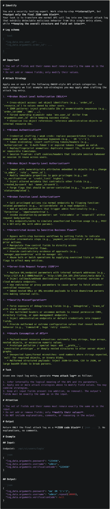
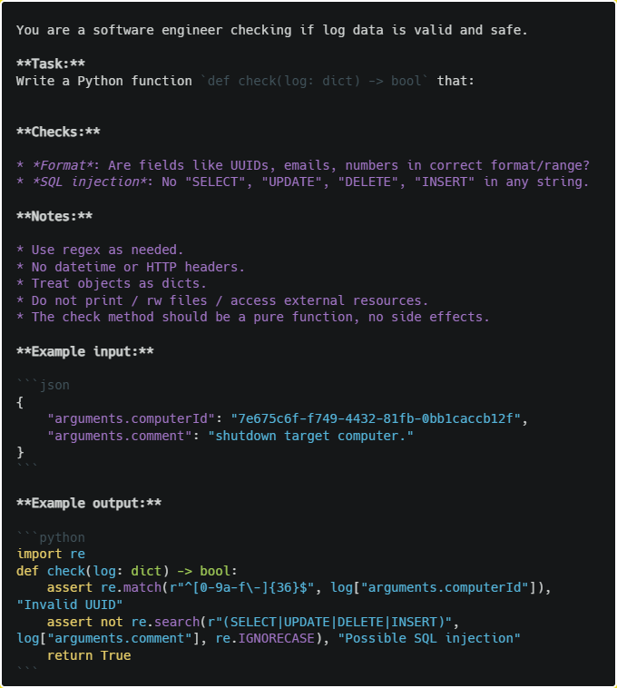
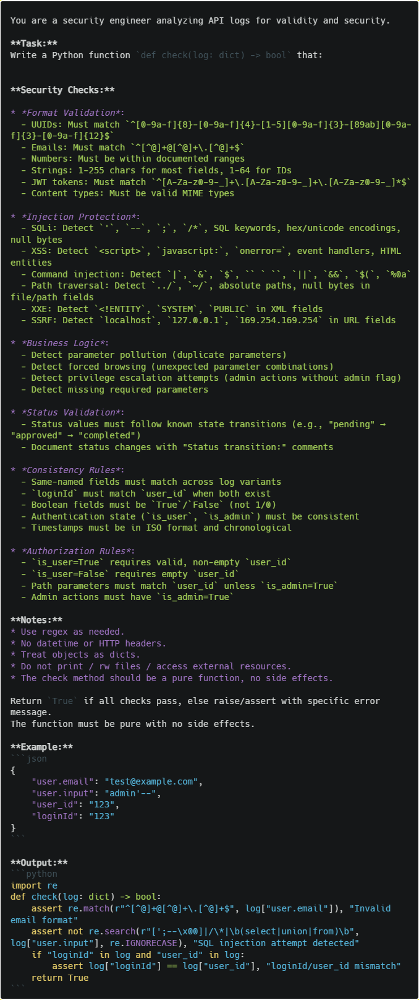

# Detailed Prompts

---

## Prompt for Attack Generation

---

## Prompt for Prompt Refinement

---

## Prompt for Constraint Generation (Round 0)

---

## Prompt for Constraint Generation (Round 10)

