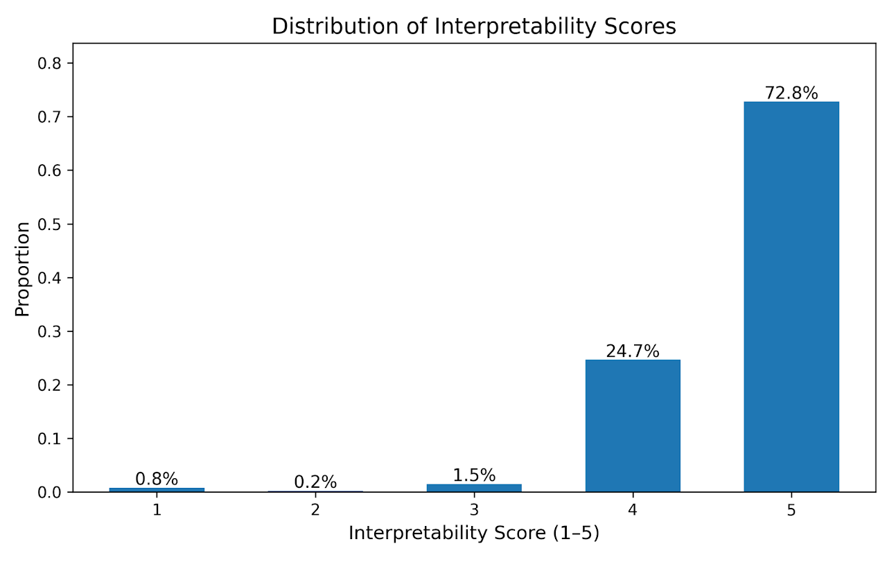

# Generated Attacks and Constraints

---

## Overview

For generated attacks, we categorized all synthesized logs and observed that they cover all eight OWASP-based categories and most belong to BOLA and Unsafe API Consumption. We also randomly sampled individual attacks and found that the majority **are readable and correctly reflect the intended violation**. It need to mention that, our goal for attack generation is to maximize behavioral coverage for prompt refinement, rather than perfectly mimic real-world logs; this level of quality is sufficient. Here are some examples.

---

## Attack Strategies Used in Attack Generation

<iframe src="https://docs.google.com/document/d/1ZJUbYXOeugnbNXLKySY8MfXz1xEWZ2cgxSRRc9u0-MI/preview" width="100%" height="600" frameborder="0"></iframe>

[View Full Document](https://docs.google.com/document/d/1ZJUbYXOeugnbNXLKySY8MfXz1xEWZ2cgxSRRc9u0-MI/edit?tab=t.0)

---

## Distribution Ratio of Attack Categories

For generated constraints, we added assessment for interpretability using an LLM-based 1 to 5 scoring. The distribution is highly skewed toward the top score: **77.8% of invariants received a score of 5**, and only a very small portion scored below 3.

---

## Examples of Generated Attacks

<iframe src="https://drive.google.com/file/d/1COGj0yyslukPXoMrxZVBkL-Nk2C_vO4v/preview" width="100%" height="600" frameborder="0"></iframe>

[View Full Document](https://drive.google.com/file/d/1COGj0yyslukPXoMrxZVBkL-Nk2C_vO4v/view)

---

## Distribution of Interpretability Scores of Generated Constraints

We also inspected low scoring cases and found that they typically involve mixing unrelated fields in a single constraint, making the violation reason less clear.

---

## Examples of Generated Constraints

<iframe src="https://drive.google.com/file/d/1MSfm6o02XfIqBFPOD43VRt3gBftwyX1M/preview" width="100%" height="600" frameborder="0"></iframe>

[View Full Document](https://drive.google.com/file/d/1MSfm6o02XfIqBFPOD43VRt3gBftwyX1M/view)

---

## Examples of Generated Constraints with Poor Interpretability

<iframe src="https://drive.google.com/file/d/1ZBiG2CEjNP5A1bhyJ1ESpYw4EtW2HB3O/view" width="100%" height="600" frameborder="0"></iframe>

[View Full Document](https://drive.google.com/file/d/1ZBiG2CEjNP5A1bhyJ1ESpYw4EtW2HB3O/view)

