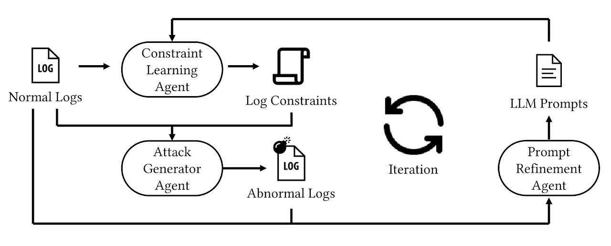

<h1 style="text-align: center; font-size: 36px; font-weight: bold; margin-bottom: 30px;">AgenticNorm: Multi-Agent Lightweight Anomaly Detection for Web Applications</h1>

---

### System Architecture

  

---

### Resources

<a href="#source-code-and-dataset" class="resource-button">Source Code and dataset</a>

<a href="#detailed-prompts" class="resource-button">Detailed Prompts</a>

<a href="#motivating-example" class="resource-button">Motivating Example</a>

<a href="#experiment-details" class="resource-button">Experimental Results</a>

---

## Video Demonstration

**[▶Watch on YouTube](https://www.youtube.com/watch?v=EuQojj03xxw)**

