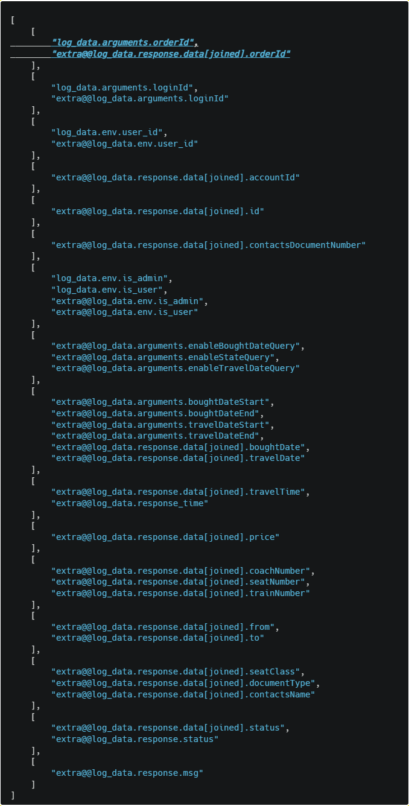
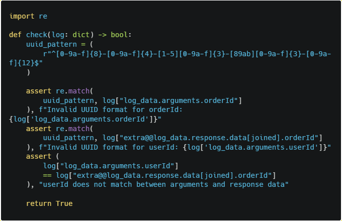

# Motivating Example

---

The motivating example is too long to be included here, so we provide it in the following Google Docs document.

<iframe src="https://docs.google.com/document/d/1UazPDPiAYaYymSCwXGRiq3g24yDjsZqqjleCJwR9O1c/preview" width="100%" height="600" frameborder="0"></iframe>

[📄 View Full Document](https://docs.google.com/document/d/1UazPDPiAYaYymSCwXGRiq3g24yDjsZqqjleCJwR9O1c/edit?tab=t.0)

---

For Field Clustering, all fields in this log entity pair are clustered into the following clusters (the first cluster contains the field we focus on):

---

For Constraints Generation, AgenticNorm generate the following Python code for the first cluster:

---

## 🔗 Related Pages

- [🏠 Home](index.md)
- [🧪 Experiment Details](experiment-details.md)
- [⚔️ Generated Attacks and Constraints](generated-attacks-and-constraints.md)
- [💾 Source Code and Dataset](source-code-and-dataset.md)
- [📋 Detailed Prompts](detailed-prompts.md)

---

*For the complete motivating example with all details, please refer to the Google Docs document linked above.*
